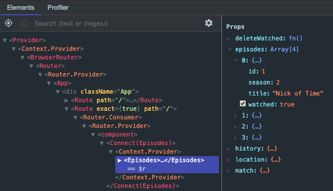
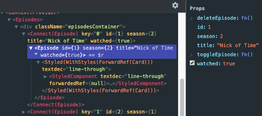
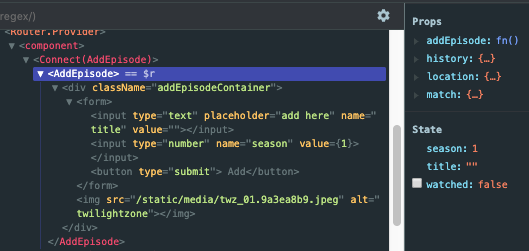
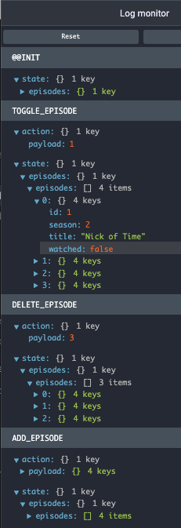
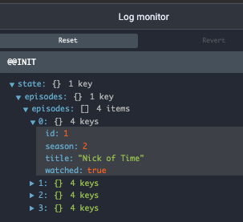
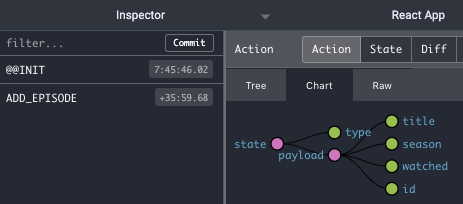

# Basic Redux experiments 3

1) Set up app `yarn create react-app` app
2) Add dependencies
    - `yarn add react-redux redux @material-ui/core styled-components react-router-dom` 
3) Resolved lodash security warnings by adding into app folder

    - `yarn add lodash lodash.template`

4) Set up Router & Redux in `index.js`
    ````
    import {Provider} from 'react-redux';
    import {createStore} from 'redux';
    import {BrowserRouter as Router} from 'react-router-dom';

    import rootReducer from './reducers';
    //const store = createStore(rootReducer);  // old way

    // Needed for Redux DevTools state debugging in Chrome!
    const store = createStore(
        rootReducer,
        window.__REDUX_DEVTOOLS_EXTENSION__ && window.__REDUX_DEVTOOLS_EXTENSION__()
    );


    ReactDOM.render(
    <Provider store = {store}> 
        <Router>
            <App/>
        </Router>
    </Provider>, 
    document.getElementById('root'));

    ````


5) Build basic `rootReducer`
    ````
    import {combineReducers} from 'redux';

    export default combineReducers({
        // leaving room for specific reducers here

    });
    ````
6) Setup `action creators`

### NOTE refactoring of the `action creator`

````
export const ADD_EPISODE = "ADD_EPISODE";

// orig
export const addEpisode = newEpisode => {
    return {
        type: ADD_EPISODE,
        payload: newEpisode
    }
};

// cleaner
export const addEpisode = newEpisode => (
        { type: ADD_EPISODE,
          payload: newEpisode  
        }    
);

// sleek
export const addEpisode = newEpisode => ({type: ADD_EPISODE, payload: newEpisode});
````

7)  Build rest of `action creators`

    export const toggleEpisode = id => ({type: TOGGLE_EPISODE, payload: id});

    export const deleteEpisode = id => ({type: DELETE_EPISODE, payload: id});

    export const deleteWatched = id => ({type: DELETE_WATCHED, payload: null}); // may not need null returned!!
    
    ````

7) Build Reducers & wire into combineReducers
    ````
    import {combineReducers} from 'redux';

    import episodeReducer from './episodeReducer';

    export default combineReducers({
        episodes: episodeReducer
    });

    ````

8) ## Using Dev Tools 

<div style = 'border: 1px solid deeppink'>
    <h3 style = 'font-weight: bold'> React & Redux DevTools </h3>
    <div style = 'display: flex; justify-content: space-evenly; margin: 10px '>    
        
        
        
    </div>
    <h3 style = 'font-weight: bold'> Redux Log Monitor</h3> 
    <div style = 'display: flex; align-items: flex-start align-content: flex-start' >
        
        
    </div>

</div>

9) `connect` USAGE 
- `conect()` will attach the AddEpisode component to the state of the Redux store`
- `connect()` will return a new connected component that wraps the AddEpisode component. 

    - In `AddEpisode` component the first time, we did NOT pass any part of the state tree in mapStateToProps. `We are NOT subscribing to any store updates`


    -   Adding to the state tree is demonstrated in Redux DevTools
    
    - mapStateToProps is not utilized
    ````
    export default connect(
    // null,        // must pass in null OR undefined
    undefined,    
    {addEpisode}
    )(AddEpisode);
    ````
    - The returned wrapper component does NOT subscribe to any Redux store updates.
    - We pass any action creators ( e.g. `addEpiode`)that are reliant on Redux & used in handlers(e.g. ` submitNewEpisode_h `). This allows us to call {addEpisode from passed in props object}
    - Our action creators will return  an object {action} that our reducer will receive.
    - IF we did not use `connect()` and instead kept AddEpisode as a `dumb component`, all of its state would be private and controlled within the component. 
    - `TypeError: this.props.addEpisode is not a function` will result if the following is used instead of `connect()`
    ````
    export default AddEpisode;
    ```` 


